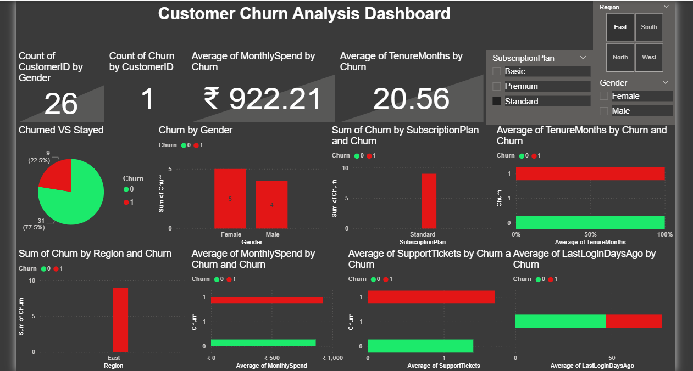
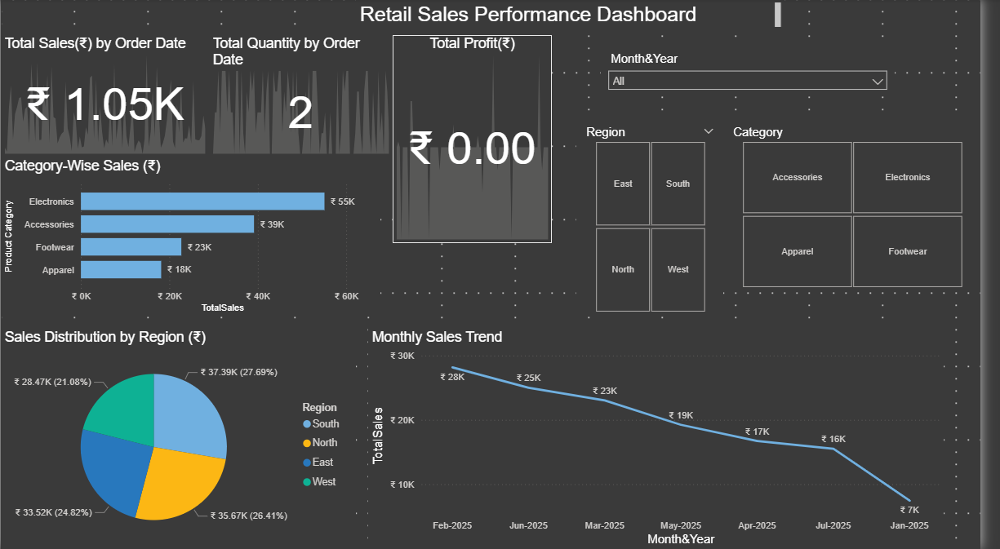
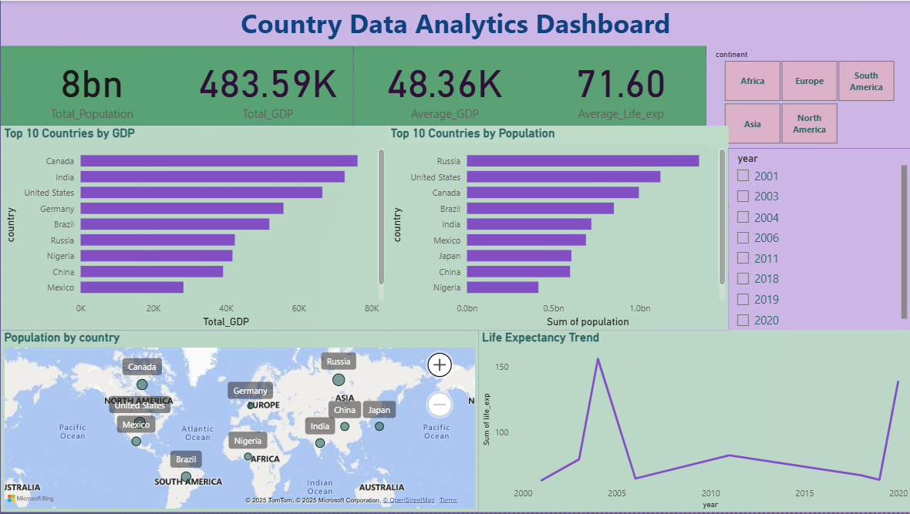
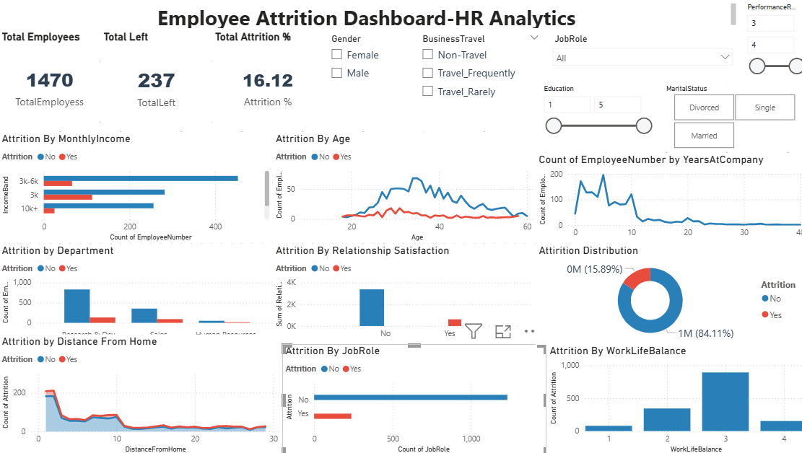

# 📊 Data Analytics Portfolio - R. Nagarjuna

Welcome to my **Data Analytics Portfolio**!  
Here you’ll find my end-to-end projects showcasing skills in **SQL, Python, Power BI, and Excel**, solving real-world business problems with data-driven insights.

---

## 🚀 Projects

### 1️⃣ [Customer Churn Analysis](https://github.com/RAVELLANAGARJUNA/CustomerChurnData)
**Tools & Skills:** Python (Pandas, NumPy, Matplotlib, Seaborn), Machine Learning (Logistic Regression, Random Forest)  
**Highlights:**
- Analyzed telecom customer data to identify churn patterns.
- Built predictive models to classify high-risk customers.
- Suggested actionable retention strategies.
  
**Screenshot:**  

---

### 2️⃣ [Retail Sales Data Analysis](https://github.com/RAVELLANAGARJUNA/RetailSalesData)
**Tools & Skills:** Python (Pandas, Matplotlib, Seaborn), Power BI  
**Highlights:**
- Cleaned and transformed sales data for analysis.
- Created visualizations to track sales trends and top products.
- Generated insights to optimize stock and marketing.

**Screenshot:**  

---

### 3️⃣ [E-Commerce SQL Project](https://github.com/RAVELLANAGARJUNA/E-CommerceCustomerData)
**Tools & Skills:** MySQL, SQL Joins, Subqueries, Window Functions  
**Highlights:**
- Designed intermediate to advanced SQL queries for sales insights.
- Analyzed customer behavior, top-selling products, and revenue trends.
- Provided business recommendations for better inventory planning.

---

### 4️⃣ [Country Data Power BI Dashboard](https://github.com/RAVELLANAGARJUNA/CountryData_PowerBI_Project)
**Tools & Skills:** Power BI, Data Modeling, DAX  
**Highlights:**
- Created an interactive dashboard for population, GDP, and life expectancy trends.
- Used slicers and filters for country/continent-level analysis.
- Designed professional and user-friendly reports.

**Screenshot:**  

---

### 5️⃣ [Employee Attrition Analysis](https://github.com/RAVELLANAGARJUNA/Employee-Attrition-Analysis)
**Tools & Skills:** Python, Power BI, SQL  
**Highlights:**
- Studied HR data to uncover key factors behind employee turnover.
- Built attrition prediction models.
- Designed an HR dashboard with attrition KPIs and demographic breakdowns.

**Screenshot:**  

---

### 6️⃣ [Sales Performance Dashboard](https://github.com/RAVELLANAGARJUNA/Sales_Dashboard)
**Tools & Skills:** Power BI, DAX, Data Cleaning  
**Highlights:**
- Built a sales performance dashboard with region, product, and category analysis.
- Used KPIs to track sales revenue and trends.
- Connected data sources and applied transformations.

**Screenshot:**  

---

## 📂 Skills Summary
- **Data Analysis Tools:** Python, SQL, Power BI, Excel  
- **Libraries:** Pandas, NumPy, Matplotlib, Seaborn, Scikit-learn  
- **Database:** MySQL  
- **Data Visualization:** Power BI Dashboards, KPI Cards, Interactive Filters  
- **Data Wrangling:** Cleaning, Transformation, Aggregation  
- **Analytics:** Exploratory Data Analysis (EDA), Business Insights, Predictive Modeling

---

## 📬 Contact
- **Name:** R. Nagarjuna  
- **Email:** arjunravella108@gmail.com  
- **LinkedIn:** [linkedin.com/in/R-Nagarjuna](https://www.linkedin.com/in/R-Nagarjuna)  
- **Portfolio Website:** [ravellanagarjuna.github.io/Portfolio](https://ravellanagarjuna.github.io/Portfolio)

---
